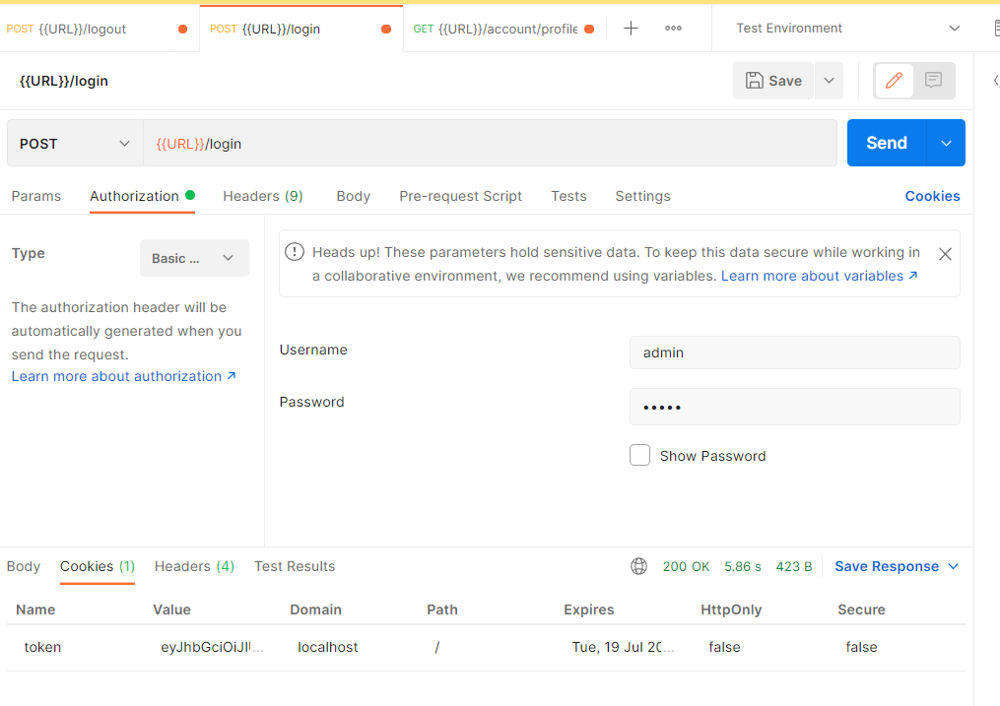
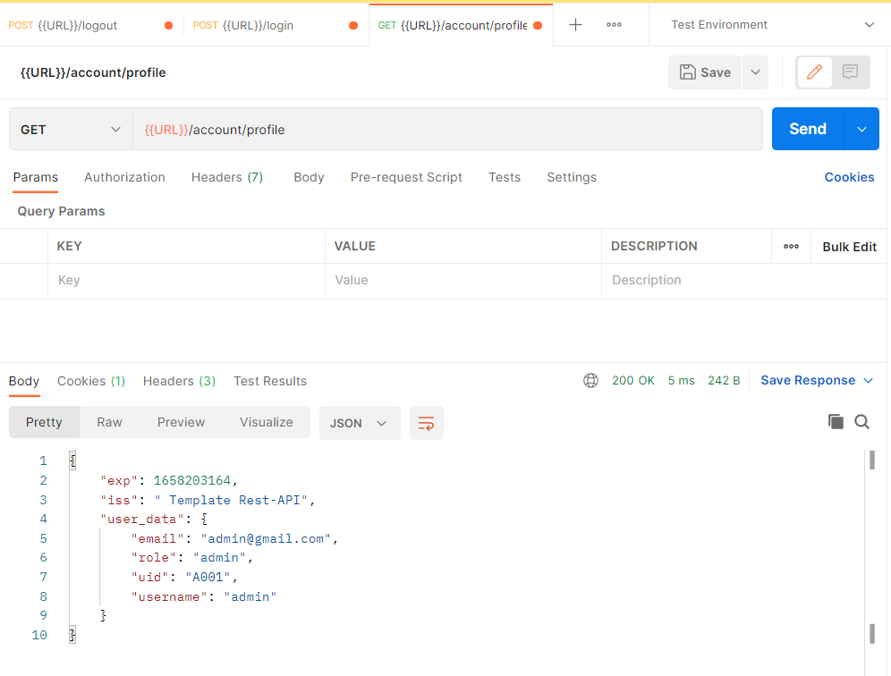
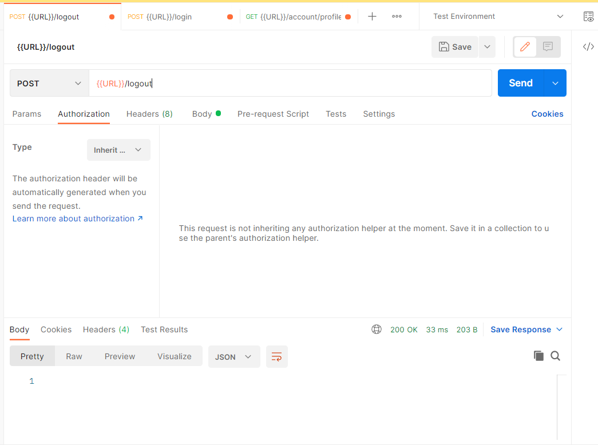
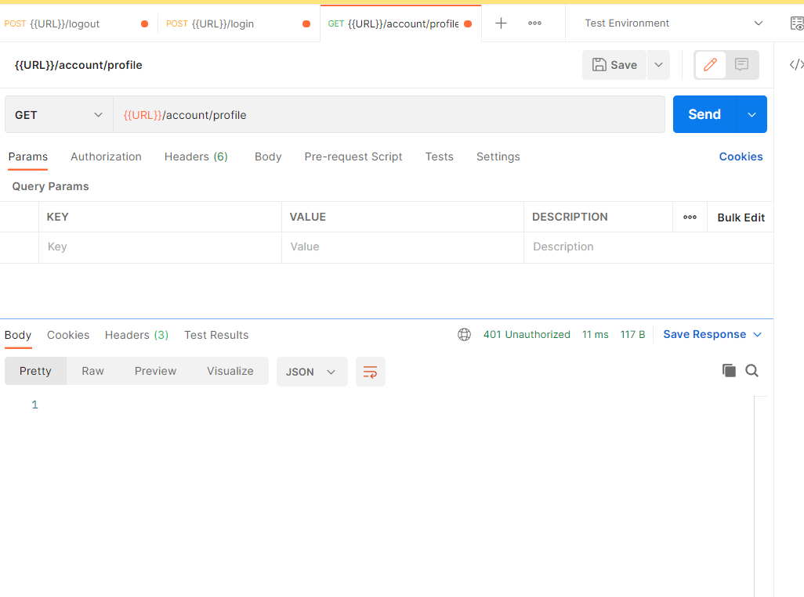

## Table of contents

- [Quick start](#quick-start)
- [What's included](#whats-included)
- [Test case](#test-case)
- [Contributing](#contributing)
- [Creators](#creators)
- [Thanks](#thanks)
- [Copyright and license](#copyright-and-license)


## Quick start

This project  development as template for future project.
Run main.go
Listen port: 8081

This project includes the following features:
- /login (POST using Basic Authentication)
- /logout (POST)
- /register (POST)
- /account/userprofile (GET need cookies to show data)
- /article/ (GET)

## What's included

```text
belajar-interface/
├── article/
│   ├── delivery/
│   │   └── delivery.go
│   ├── helper/
│   │   └── respons.go
│   ├── model/
│   │   └── model.go
│   ├── repoitory/
│   │   └── repo.go
│   └── service/
│       └── service.go
├── user/
│   ├── delivery/
│   │   └── delivery.go
│   ├── helper/
│   │   └── respons.go
│   ├── model/
│   │   └── model.go
│   ├── repoitory/
│   │   └── repo.go
│   └── service/
│       └── service.go
├── database/
│   └── db.go
├── route/
│   └── route.go
├── middleware/
│   └── middleware.go
├── go.mod
├── go.sum
├── main.go
└── ReadMe.md

```
## Test case

- ### Testing login endpoint <br /> 
- ### Testing acces account profile endpoint with cookies <br /> 
- ### Testing logout endpoint <br /> 
- ### Testing acces account profile endpoint without cookies <br /> 


## Creators

**Creator 1**

- <https://github.com/madeadisusilayasa>

## Thanks

## Copyright and license

Code and documentation copyright 2011-2018 the authors. Code released under the [MIT License](https://reponame/blob/master/LICENSE).
